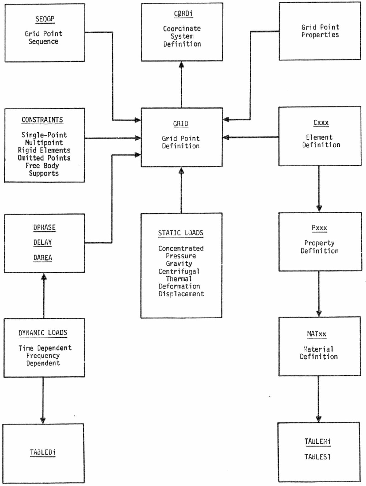

# STRUCTURAL MODELING  {#s1-struct-model}


## Introduction 

NASTRAN embodies a lumped element approach, wherein the distributed 
physical properties of a structure are represented by a model consisting of a 
finite number of idealized substructures or elements that are interconnected 
at a finite number of grid points, to which loads are applied. All input and 
output data pertain to the idealized structural model. The major components in 
the definition and loading of a structural model are indicated in 
Figure \@ref(fig:structural-model).  

   As indicated in Figure \@ref(fig:structural-model), 
   the grid point definition forms the basic 
framework for the structural model. All other parts of the structural model 
are referenced either directly or indirectly to the grid points. 

   Two general types of grid points are used in defining the structural model. 
They are: 

1. Geometric grid point - a point in three-dimensional space at which three 
    components of translation and three components of rotation are defined. 
    The coordinates of each grid point are specified by you. 

1. Scalar point - a point in vector space at which one degree of freedom is 
    defined. Scalar points can be coupled to geometric grid points by means 
    of scalar elements and by constraint relationships. 


The structural element is a convenient means for specifying many of the 
properties of the structure, including material properties, mass distribution, 
and some types of applied loads. In static analysis by the displacement 
method, stiffness properties are input exclusively by means of structural 
elements. Mass properties (used in the generation of gravity and inertia 
loads) are input either as properties of structural elements or as properties 
of grid points. In dynamic analysis, mass, damping, and stiffness properties 
may be input either as the properties of structural elements or as the 
properties of grid points (direct input matrices). 

Structural elements are defined on connection cards by referencing grid 
points, as indicated on Figure \@ref(fig:structural-model). 
In a few cases, all of the information 
required to generate the structural matrices for the element is given on the 
connection card. In most cases the connection card refers to a property card, 
on which the cross-sectional properties of the element are given. The property 
card in turn refers to a material card which gives the material properties. If 
some of the material properties are stress dependent or temperature dependent, 
a further reference is made to tables for this information. 

Various kinds of constraints can be applied to the grid points. 
Single-point constraints are used to specify boundary conditions, including enforced 
displacements of grid points. Multipoint constraints and rigid elements are 
used to specify linear relationships among selected degrees of freedom. 
Omitted points are used as a tool in matrix partitioning and for reducing the 
number of degrees of freedom used in dynamic analysis. Free-body supports are 
used to remove stress-free motions in static analysis and to evaluate the 
free-body inertia properties of the structural model. 

Static loads may be applied to the structural model by concentrated loads 
at grid points, pressure loads on surfaces, or indirectly, by means of the 
mass and thermal expansion properties of structural elements or enforced 
deformations of one-dimensional structural elements. Due to the great variety 
of possible sources for dynamic loading, only general forms of loads are 
provided for use in dynamic analysis. 

The following sections describe the general procedures for defining 
structural models. Detailed instructions for each of the bulk data cards and 
case control cards are given in Section \@ref(s2-nastran-data-decks). 
Additional information on the case 
control cards and use of parameters is given for each rigid format in 
Section \@ref(s3-rigid-formats). 


```{r structural-model, echo=FALSE, fig.cap='Structural Model.', out.width='100%', fig.align='center'}

```
