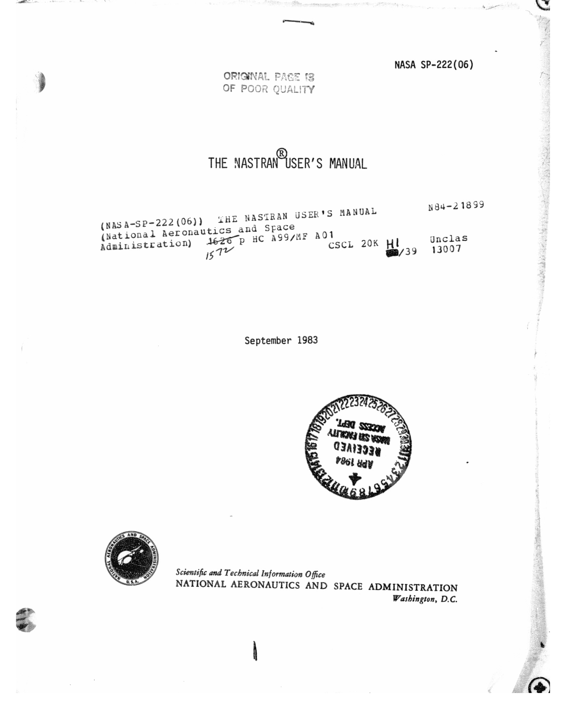

--- 
title: "NASTRAN User Manual"
author: "[Stephen McEntee](https://qwilka.github.io/)"
date: "`r Sys.Date()`"
description: NASTRAN documentation (unofficial).
documentclass: book
github-repo: qwilka/NASTRAN-95
link-citations: yes
bibliography:
- references.bib
site: bookdown::bookdown_site
biblio-style: apalike
---

<!--"Testing The NASTRAN user's manual"-->
# NASTRAN User Manual v1 {-}

The NASTRAN user's manual  [@NASTRAN_UM1]. 
All information directly associated with problem solving using the NASTRAN program is presented. This structural analysis program uses the finite element approach to structural modeling wherein the distributed finite properties of a structure are represented by a finite element of structural elements which are interconnected at a finite number of grid points, to which loads are applied and for which displacements are calculated. Procedures are described for defining and loading a structural model. Functional references for every card used for structural modeling, the NASTRAN data deck and control cards, problem solution sequences (rigid formats), using the plotting capability, writing a direct matrix abstraction program, and diagnostic messages are explained. A dictionary of mnemonics, acronyms, phrases, and other commonly used NASTRAN terms is included.

## INTRODUCTION {-}

The User's Manual is one of four manuals that constitute the documentation
for NASTRAN, the other three being the Theoretical Manual, the Programmer's
Manual, and the Demonstration Problem Manual. Although the User's Manual
contains all of the information that is directly associated with the solution
of problems with NASTRAN, you will find it desirable to refer to the other
manuals for assistance in the solution of specific  problems.

The Theoretical Manual gives an excellent introduction to NASTRAN and
presents developments of the analytical and numerical procedures that underlie
the program. The User's Manual is instructive and encyclopedic in nature, but
is restricted to those items related to the use of NASTRAN that are generally
independent of the computing system being used. Computer-dependent topics and
information that is required for the maintenance and modification of the
program are treated in the Programmer's Manual. The Programmer's Manual also
provides a complete description of the program, including the mathematical
equations implemented in the code. The Demonstration Problem Manual presents a
discussion of the sample problems delivered with NASTRAN, thereby illustrating
the formulation of the different types of problems that can be solved with
NASTRAN. 

In addition to the four manuals described above, there is also a NASTRAN
User's Guide that serves as a handbook for users. It describes all of the
NASTRAN features and options and illustrates them by examples. Other excellent
sources for NASTRAN-related topics are the proceedings of the NASTRAN Users'
Colloquia (held normally every year) which provide a large body of information
based on user experiences with NASTRAN. 

The User's Manual has recently been completely revised and updated. The
material on rigid formats that was in Volume II has moved to the rigid format
source files as comments or, in the case of general information, back into
this single volume User's Manual as Section 3.

NASTRAN uses the finite element approach to structural modeling, wherein
the distributed physical properties of a structure are represented by a finite
number of structural elements which are interconnected at a finite number of
grid points, to which loads are applied and for which displacements are
calculated. The procedures for defining and loading a structural model are
described in Section 1. This section contains a functional reference for every
card that is used for structural modeling. 

The NASTRAN Data Deck, including the details for each of the data cards, is
described in Section 2. This section also discusses the NASTRAN control cards
that are associated with the use of the program. 

Section 3 contains a general description of rigid format procedures.
Specific instructions and information for the use of each rigid format are
given in comments included in each source file.

The procedures for using the NASTRAN plotting capability are described in
Section 4. Both deformed and undeformed plots of the structural model are
available. Response curves are also available for static, transient response,
frequency response, modal flutter,and modal aeroelastic response analyses. 

NASTRAN contains problem solution sequences, called rigid formats. Each of
these rigid formats is associated with the solution of problems for a
particular type of static or dynamic analysis. In addition to the rigid format
procedures, you may choose to write your own Direct Matrix Abstraction Program
(DMAP). This procedure permits you to execute a series of matrix operations of
his choice along with any utility modules or executive operations that he may
need. The rules governing the creation of DMAP programs are described in
Section 5. 

The NASTRAN diagnostic messages are documented and explained in Section 6.
The NASTRAN Dictionary, in Section 7, contains descriptions of mnemonics,
acronyms, phrases, and other commonly used NASTRAN terms. 

There is a limited number of sample problems included in the User's Manual.
However, a more comprehensive set of demonstration problems, at least one for
each of the rigid formats, is described in the NASTRAN Demonstration Problem
Manual. The data decks are available on tape for each of the computer systems
on which NASTRAN has been implemented. Samples of the printer output and of
structure plots and response plots can be obtained by executing these
demonstration problems. The printer output for these problems is also
available on microfiche.
